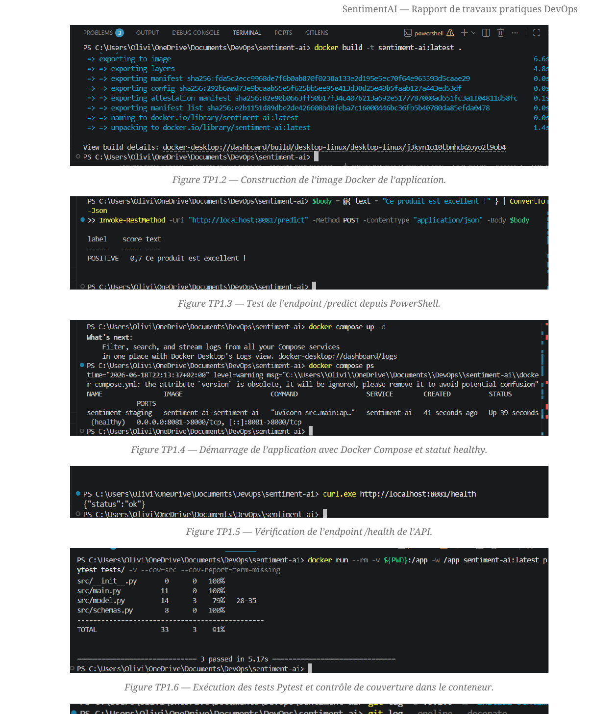
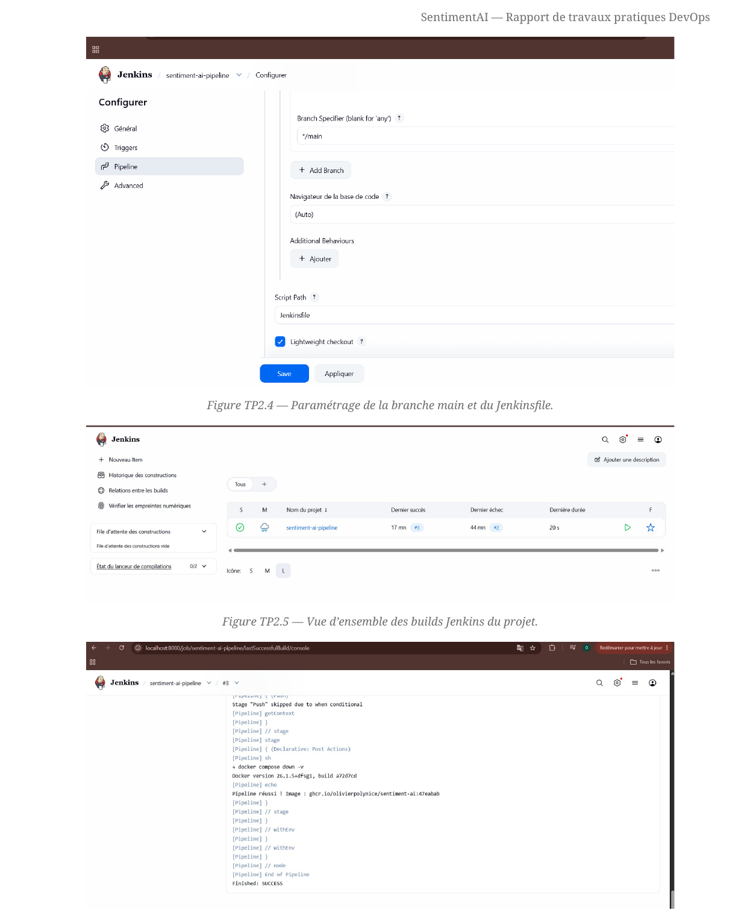
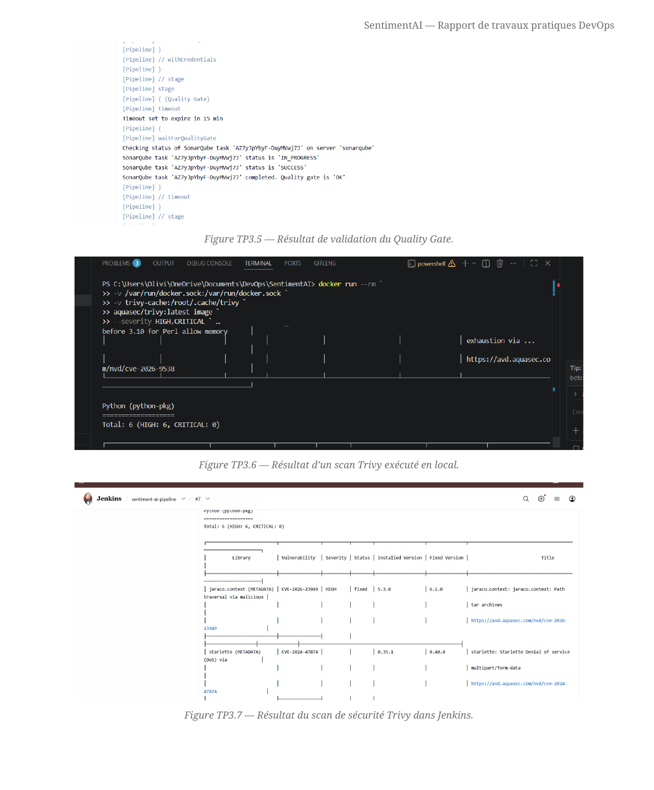
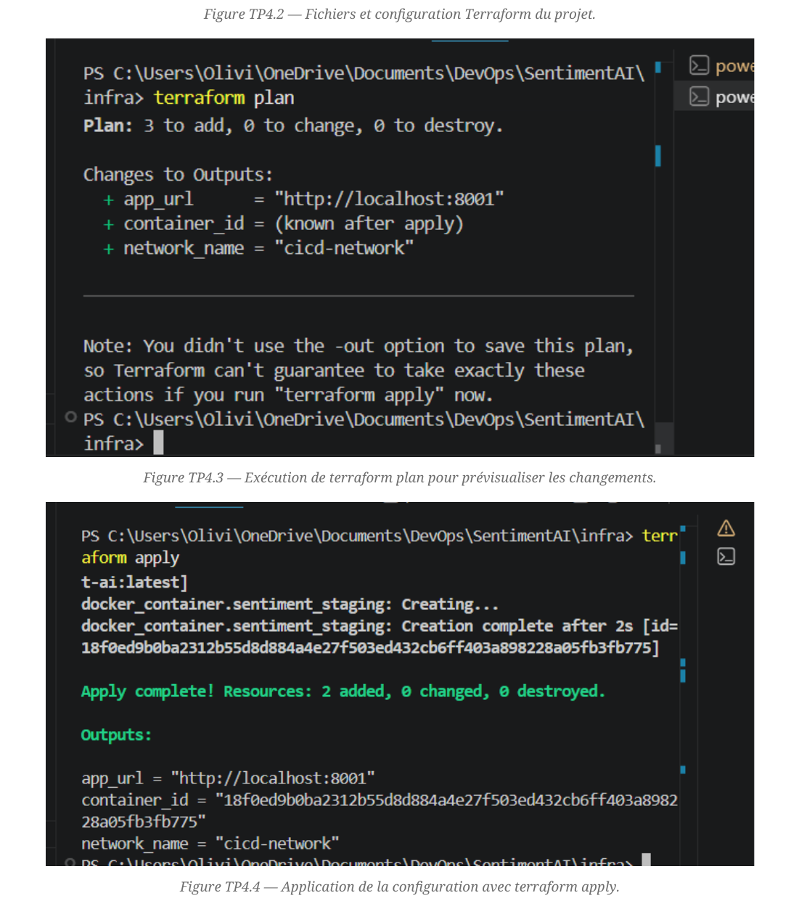
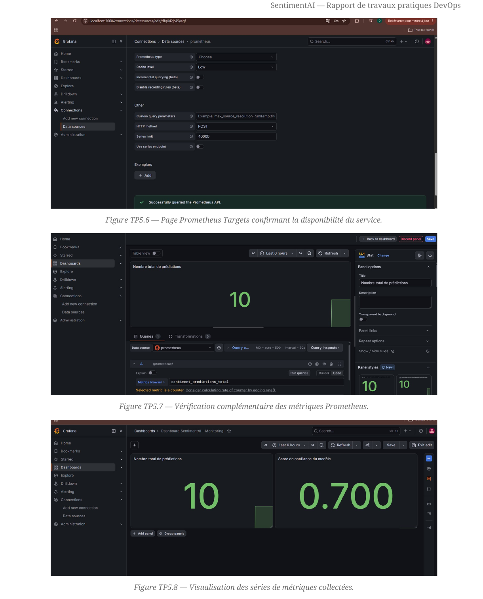

# SentimentAI — Projet DevOps

<div align="center">


</div>

## Présentation

**SentimentAI** est une API REST développée avec **Python** et **FastAPI**.

Elle analyse un texte et retourne une prédiction de sentiment parmi les catégories suivantes :

- `POSITIVE` : sentiment positif ;
- `NEGATIVE` : sentiment négatif ;
- `NEUTRAL` : sentiment neutre.

Le projet a été réalisé dans le cadre des travaux pratiques DevOps. Il permet de mettre en œuvre une chaîne complète allant du versionnement du code jusqu’au monitoring de l’application.

Le dépôt couvre notamment :

- la gestion du code avec Git et GitHub ;
- la conteneurisation avec Docker et Docker Compose ;
- les tests automatisés avec Pytest ;
- l’intégration continue avec Jenkins ;
- l’analyse de qualité avec SonarQube ;
- le scan de sécurité avec Trivy ;
- le déploiement déclaratif avec Terraform ;
- le monitoring avec Prometheus et Grafana.

---

## Fonctionnalités de l’API

| Endpoint | Méthode | Rôle |
|---|---|---|
| `/health` | `GET` | Vérifie que l’API est disponible |
| `/predict` | `POST` | Analyse le sentiment d’un texte |
| `/metrics` | `GET` | Expose les métriques Prometheus |

### Exemple de requête

```bash
curl -X POST "http://localhost:8081/predict" \
-H "Content-Type: application/json" \
-d "{\"text\":\"Ce produit est excellent\"}"
```

### Exemple de réponse

```json
{
  "label": "POSITIVE",
  "score": 0.7,
  "text": "Ce produit est excellent"
}
```

---

## Architecture DevOps

```text
GitHub
  ↓
Jenkins Pipeline
  ↓
Lint → Tests → Build Docker
  ↓
SonarQube → Quality Gate
  ↓
Trivy → Scan de sécurité
  ↓
Terraform → Déploiement staging
  ↓
Prometheus → Grafana
```

---

## Travaux pratiques réalisés

| TP | Objectif | Outils principaux |
|---|---|---|
| TP1 | Gestion du code, Docker et tests automatisés | Git, Docker, Docker Compose, Pytest |
| TP2 | Mise en place d’un pipeline CI/CD | Jenkins, GitHub Container Registry |
| TP3 | Contrôle de la qualité et de la sécurité | SonarQube, Trivy |
| TP4 | Déploiement Infrastructure as Code | Terraform, Docker provider |
| TP5 | Observabilité et supervision | Prometheus, Grafana, Jenkins |

---

## Structure du projet

```text
SentimentAI/
├── infra/                  # Infrastructure Terraform
├── monitoring/             # Prometheus et configuration monitoring
├── images/                 # Captures de validation des TP
├── src/                    # Code source FastAPI
│   ├── __init__.py
│   ├── main.py
│   ├── model.py
│   └── schemas.py
├── tests/                  # Tests automatisés Pytest
│   ├── __init__.py
│   └── test_api.py
├── Dockerfile
├── docker-compose.yml
├── Jenkinsfile
├── Makefile
├── requirements.txt
└── README.md
```

---

## Installation locale

### Prérequis

- Python 3.12
- Docker Desktop
- Docker Compose
- Git
- Terraform
- Jenkins
- SonarQube

### Cloner le dépôt

```bash
git clone https://github.com/olivierpolynice/sentiment-ai.git
cd sentiment-ai
```

### Créer un environnement virtuel

Sous Windows PowerShell :

```powershell
python -m venv .venv
.\.venv\Scripts\Activate.ps1
```

### Installer les dépendances

```bash
pip install -r requirements.txt
```

---

## Lancer l’application localement

```bash
uvicorn src.main:app --reload
```

L’API sera disponible sur :

```text
http://127.0.0.1:8000
```

Documentation Swagger :

```text
http://127.0.0.1:8000/docs
```

---

## Lancer le projet avec Docker Compose

```bash
docker compose up -d --build
```

L’application est exposée sur :

```text
http://localhost:8081
```

Vérification de santé :

```bash
curl http://localhost:8081/health
```

Réponse attendue :

```json
{
  "status": "ok"
}
```

Pour arrêter les conteneurs :

```bash
docker compose down
```

---

## Tests automatisés

Les tests vérifient notamment :

- le bon fonctionnement de l’endpoint `/health` ;
- la validité de la réponse `/predict` ;
- le rejet d’un texte vide avec une erreur HTTP 422 ;
- la couverture du code source.

Exécution des tests :

```bash
make test
```

Exécution du lint :

```bash
make lint
```

Dans l’exécution documentée, les tests ont atteint une couverture de **91 %**.

---

## Pipeline Jenkins

Le pipeline Jenkins automatise les principales étapes de validation et de livraison :

1. récupération du code depuis GitHub ;
2. analyse du style avec Flake8 ;
3. construction de l’image Docker ;
4. exécution des tests Pytest et contrôle de couverture ;
5. analyse de qualité avec SonarQube ;
6. validation du Quality Gate ;
7. scan de sécurité avec Trivy ;
8. publication de l’image Docker selon les conditions prévues ;
9. validation et déploiement de l’infrastructure avec Terraform ;
10. vérification du bon fonctionnement de l’application.

Les images Docker utilisent le SHA court du commit Git comme tag afin de conserver une traçabilité précise entre le code source et l’image construite.

---

## Qualité et sécurité

### SonarQube

SonarQube analyse :

- les bugs potentiels ;
- les Code Smells ;
- les duplications ;
- la maintenabilité ;
- la couverture des tests ;
- le Quality Gate.

Le pipeline Jenkins attend le résultat du Quality Gate avant de poursuivre les étapes suivantes.

### Trivy

Trivy analyse l’image Docker afin d’identifier les vulnérabilités connues dans :

- l’image de base ;
- les paquets système ;
- les dépendances Python ;
- les bibliothèques utilisées par l’application.

Le scan est exécuté avant la publication de l’image afin de détecter les vulnérabilités avant le déploiement.

---

## Infrastructure as Code avec Terraform

Terraform permet de décrire et de déployer l’environnement de staging de SentimentAI de manière déclarative.

Les principales commandes sont :

```bash
terraform init
terraform fmt
terraform validate
terraform plan
terraform apply
```

Terraform permet notamment :

- de gérer l’image Docker ;
- de créer et configurer le conteneur de l’application ;
- de gérer le réseau Docker ;
- de définir les ports et variables d’environnement ;
- de conserver un déploiement reproductible et idempotent.

Le dossier `.terraform/` ainsi que les fichiers `terraform.tfstate` et `terraform.tfstate.backup` ne doivent pas être envoyés sur GitHub.

---

## Monitoring

L’application expose des métriques Prometheus accessibles via :

```text
/metrics
```

Les métriques principales incluent :

- `sentiment_predictions_total` : nombre total de prédictions réalisées ;
- `sentiment_confidence_score` : score de confiance de la dernière prédiction ;
- `http_requests_total` : nombre de requêtes HTTP traitées.

Prometheus collecte les métriques exposées par l’application.

Grafana permet ensuite de visualiser ces données dans un dashboard afin de suivre :

- le nombre de prédictions ;
- le statut des requêtes ;
- le trafic HTTP ;
- les erreurs éventuelles ;
- le score de confiance des prédictions.

---

## Captures de validation

### TP1 — Git, Docker et tests automatisés

L’application SentimentAI a été versionnée avec Git, conteneurisée avec Docker et vérifiée avec Docker Compose. Les tests Pytest ont validé les endpoints `/health` et `/predict`.



### TP2 — Jenkins et intégration continue

Jenkins récupère le code depuis GitHub, exécute le linting et les tests, construit l’image Docker puis publie l’image lorsque les conditions du pipeline sont respectées.



### TP3 — Qualité logicielle et sécurité

Le pipeline intègre SonarQube pour l’analyse de qualité et la validation du Quality Gate. Trivy est utilisé pour détecter les vulnérabilités présentes dans l’image Docker et ses dépendances.



### TP4 — Infrastructure as Code avec Terraform

Terraform décrit et déploie l’environnement de staging de SentimentAI avec le provider Docker. La configuration permet de vérifier le plan, d’appliquer les ressources et de contrôler l’idempotence du déploiement.



### TP5 — Monitoring avec Prometheus et Grafana

L’application expose des métriques Prometheus relatives aux requêtes HTTP, aux prédictions et au score de confiance. Prometheus collecte ces données et Grafana permet leur visualisation dans un dashboard.



---

## Technologies utilisées

| Domaine | Technologies |
|---|---|
| Développement | Python, FastAPI |
| Tests | Pytest, Coverage |
| Versionnement | Git, GitHub |
| Conteneurisation | Docker, Docker Compose |
| CI/CD | Jenkins |
| Qualité logicielle | Flake8, SonarQube |
| Sécurité | Trivy |
| Infrastructure as Code | Terraform |
| Monitoring | Prometheus, Grafana |

---

## Auteur

**Olivier Polynice**

- GitHub : [olivierpolynice](https://github.com/olivierpolynice)
- Dépôt du projet : [sentiment-ai](https://github.com/olivierpolynice/sentiment-ai)

---

## Licence

Ce projet est distribué sous licence MIT.
